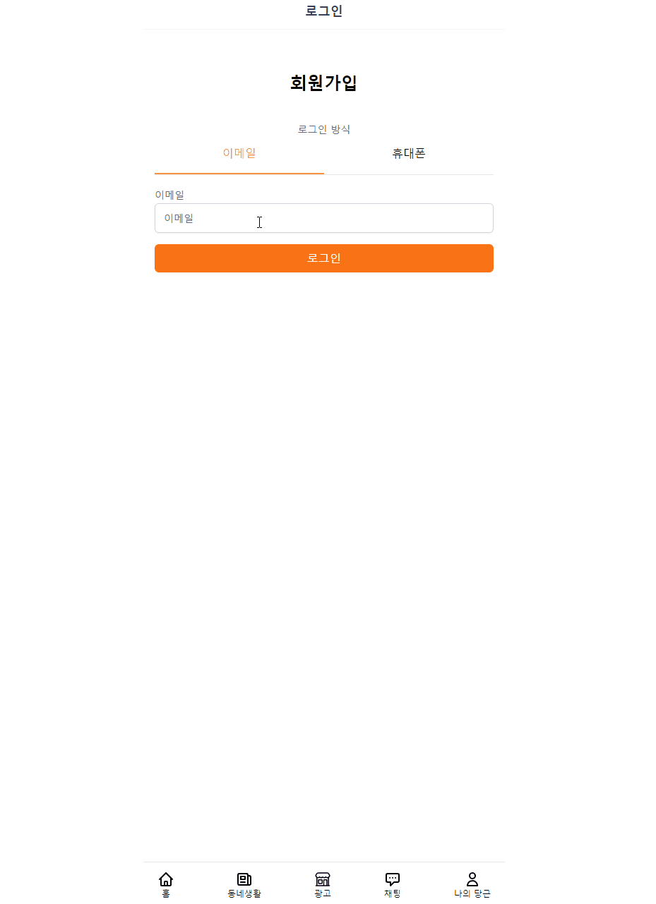
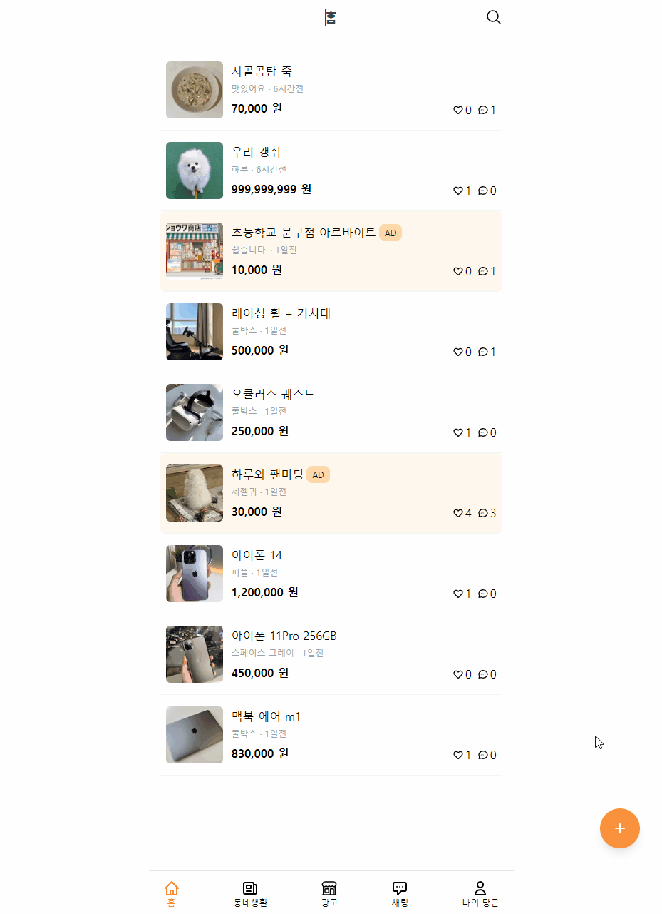
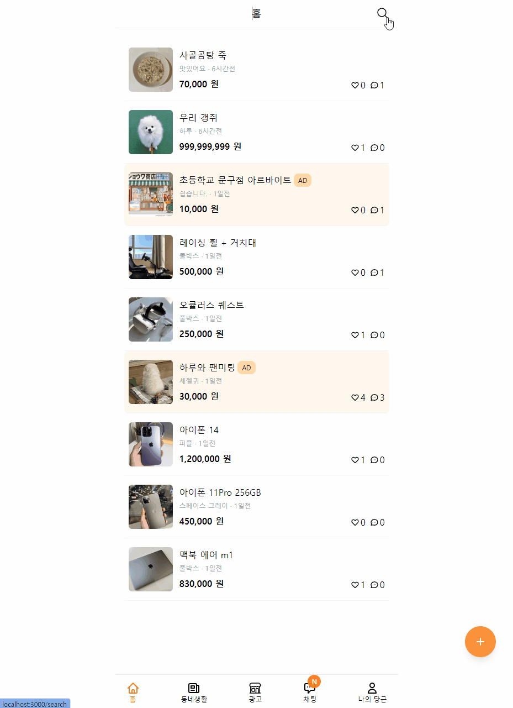
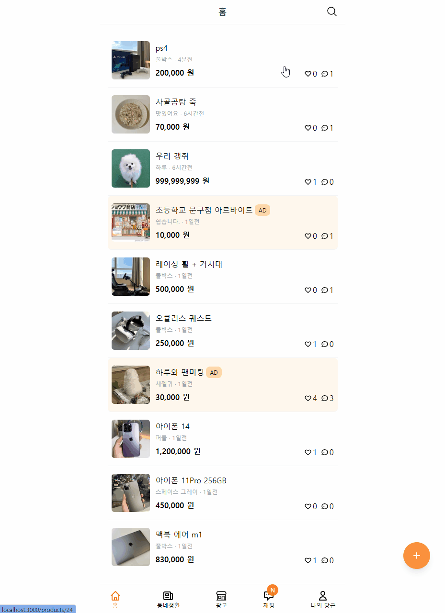
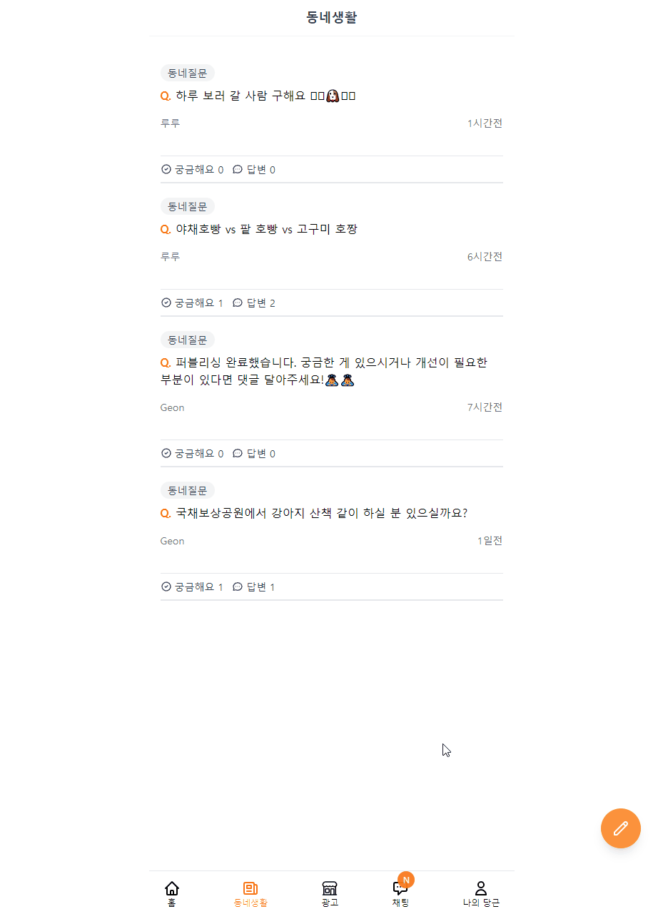
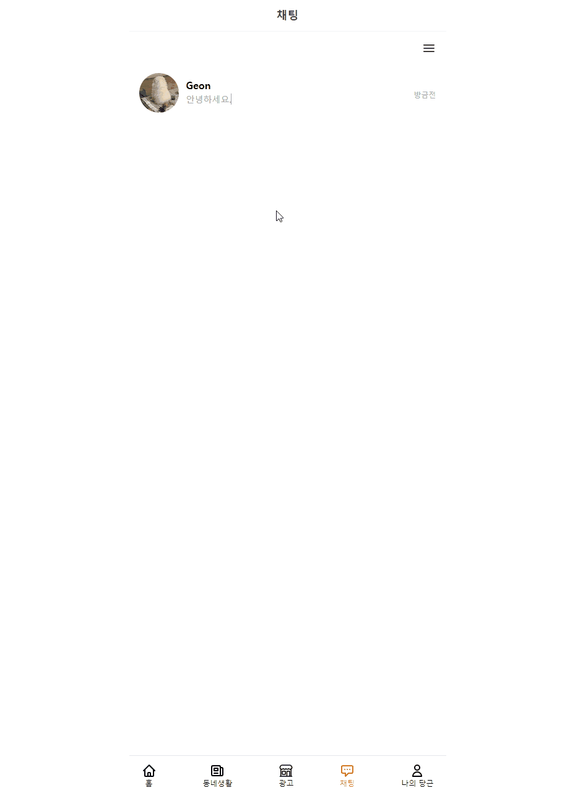
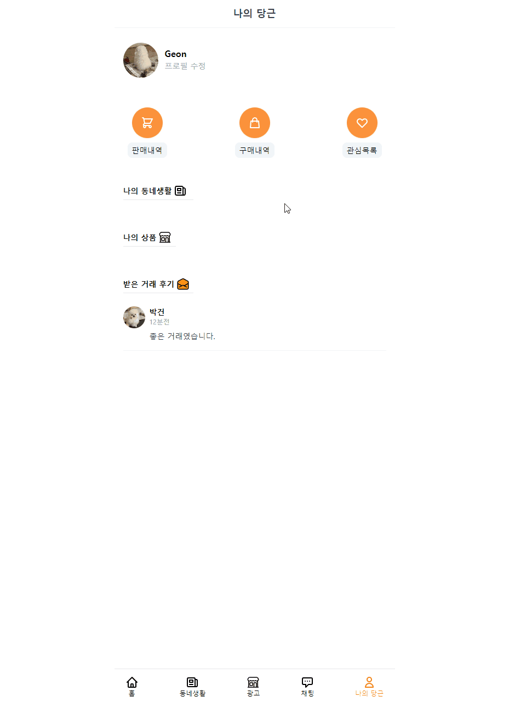
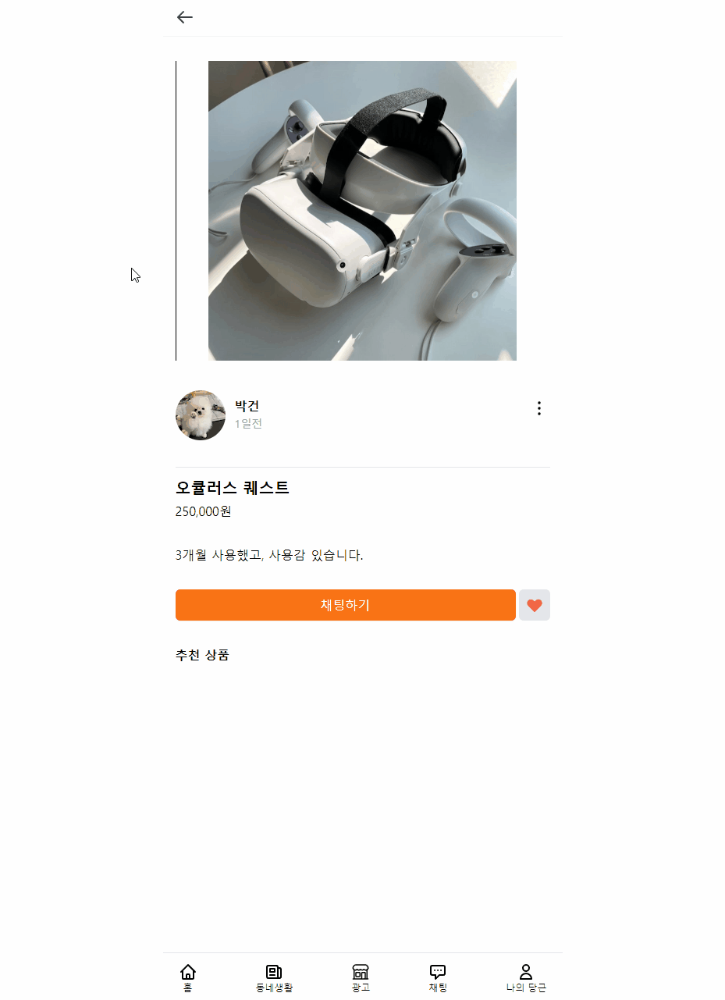

  <a href="https://carrot-market-geon1999.vercel.app/">
    
      
    <a display="block" href="https://carrot-market-geon1999.vercel.app/">당근마켓으로 이동</a>
  </a>

## Index 🙇‍♂️
- ⭐ [Preview](#Preview)
- 💥 [Built with](#built-with)

## Preview 

 

 #### 1. 로그인
- 이메일 입력시 `emailJs` 를 통해 인증 코드를 전송
- `user` 생성
- 전송 받은 코드 입력시 `Iron Session` 을 통해 `user` 정보를 `session` 에 저장
- 프로필 설정

 

  
 

 #### 2. 상품 업로드
- 상품 정보를 입력 
- 상품 등록 버튼 클릭시 상품 생성

 

  
 

 

 
 #### 3. 상품 상세정보
 - 하트 버튼을 통해 관심상품 등록
 - 채팅하기를 통해 상품 판매자와 채팅
 
  

  
 

 

  
  #### 4. 상품 검색
  - 상품을 검색할 수 있습니다.
  
 

  
 

 

  
#### 5. 상품 검색
- 상품 판매자는 채팅 내역이 있는 유저 중 선택하여 판매완료 처리를 할 수 있습니다.
- 판매완료 처리시 구매자에게 리뷰를 남길 수 있습니다.
- 판매자에겐 판매내역에, 구매자에겐 구매내역에 해당 상품이 자동으로 업로드 됩니다.
  
 

  
 

 

  
#### 6. 동네생활
- 동네생활에 등록된 게시글에 댓글을 달고 삭제할 수 있습니다.
- 궁금해요 버튼을 통해 관심도를 표현할 수 있습니다.
  
 

  
 

 

  
#### 7. 채팅
- 상품 판매자에게 채팅할 수 있습니다.
- 채팅 전송시 판매자에게 채팅 알림이 발생합니다(구매자도 메신저 수신시 동일)

 

  
 

 

  
#### 8. 프로필
- 자신이 등록한 게시글을 확인하고 클릭시 이동 가능합니다.
- 상품 구매시 판매자로부터 수신한 거래 후기를 확인할 수 있습니다.
- 프로필 수정을 통해 이름 및 정보들을 변경할 수 있습니다.

 

  
 

 

  
#### 9. 다른 유저의 프로필
- 다른 유저의 프로필 이미지 클릭시 해당 유저의 정보를 확인할 수 있습니다.(채팅 목록에서는 제외)

 

  
 

 

## Built with

> Front-end

- <a href="./README/NextJs.md">`NextJS`</a>
- `React`
- `Typescript`
- <a href="./README/SWR.md">`SWR`</a>
- <a href="./README/Tailwind.md">`TailwindCSS`</a>

 

> Back-end

- <a href="./README/Prisma & PlanetScale.md">`PlanetScale`</a>
- <a href="./README/Prisma & PlanetScale.md">`Prisma`</a>
- <a href="./README/TWILIO & NODEMAILER.md">`Twilio`</a> 
- `emailJs`
- <a href="./README/IronSession.md">`Iron Session`</a>  
- <a href="./README/Cloudflare.md">`Cloudflare Images`</a>   

 

> Deploy

- `Vercel`
- <a href="./README/Prisma & PlanetScale.md">`PlanetScale`</a>
- <a href="./README/Cloudflare.md">`Cloudflare`</a>   
