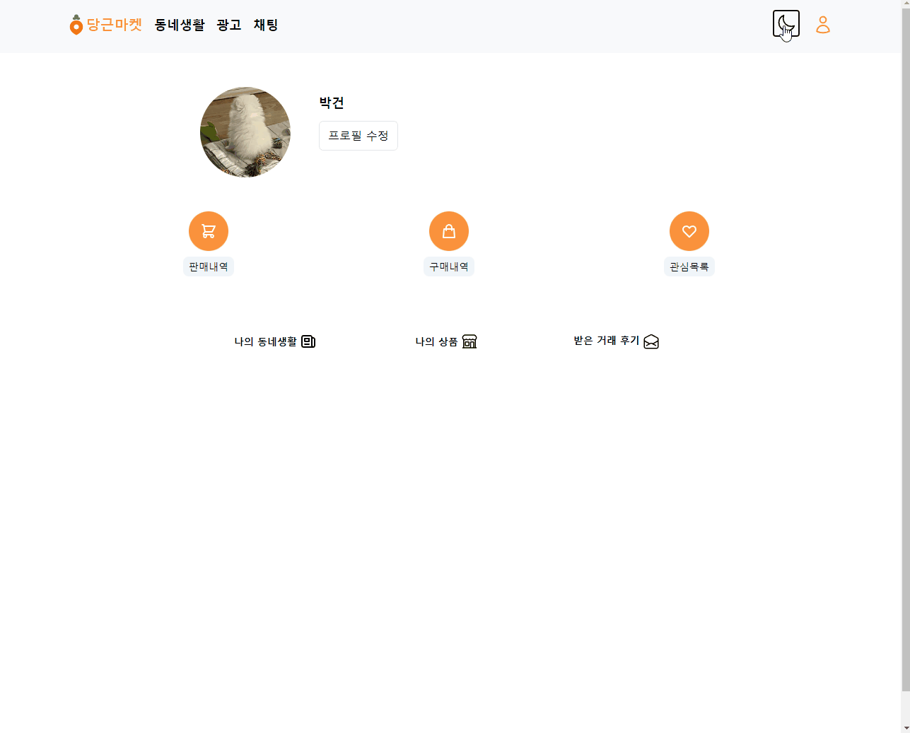

  <a href="https://carrot-market-geon1999.vercel.app/">
    
      
    <a display="block" href="https://carrot-market-geon1999.vercel.app/">당근마켓으로 이동</a>
  </a>

## Index 🙇‍♂️
- ⭐ [Preview](#Preview)
- 💥 [Built with](#built-with)

## Preview 

 

 #### 1. 로그인
- 이메일 입력시 `emailJs` 를 통해 인증 코드를 전송
- `user` 생성
- 전송 받은 코드 입력시 `Iron Session` 을 통해 `user` 정보를 `session` 에 저장
- 프로필 설정

 

  
 

 #### 2. 상품 업로드
- 상품 정보를 입력 
  - useForm 에 입력된 데이터를 post fetch 를 해주는 useMutaion 에 전달. 
  
- 상품 등록 버튼 클릭시 상품 생성
  - 서버에 전달된 데이터를 req.body 를 통해 수신하고 prisma 를 통해 만들어진 model 에 required 된 data 를 기입
  
 

  
 

 

 
#### 3. 상품 상세정보
  - 하트 버튼을 통해 관심상품 등록
    1. frontend 에서는 버튼 클릭시 `useSWR` 에서의 `mutate` 를 통해 즉시 상태를 현재와 반대로 만들고 UI 즉시 반영 (하트 활성시 비황설화, 비활성시 활성화)
    2. 버튼클릭시 interface 를 즉시 변경함과 동시에 `useMutation` 을 통해 backend 에서 toggle 됨을 알려줌
  - toggle 되면 `req.session` 에서 user 을 찾고 `req.query` 에서 상품 id 를 찾음 user 와 상품 정보로 관싱삼풍으로 활성화되어있는지 확인. 활성화 되어 있을시 삭제하고 비활성화 시 활성화 함
    
 
    
  - 채팅하기를 통해 상품 판매자와 채팅
    1. 채팅하기 버튼 클릭시 `sellerId` 와 `session` 에 있는 user(클릭한 유저) 를 토대로 backend 에서 chatRoom 을 만듬
    2. 채팅룸이 정상적으로 만들어졌다면 backend 에서 `res.json` 을 통해 `ok : true ` 임을 전달하고 data 안에 `chatRoomId` 를 전달함 frontend 에서 `useEffect` 를 사용해 ok: true 임이 확인되면 만들어진 채팅룸으로 이동(data 안의 chatRoomId 를 통해 경로 설정) 
 
  

  
 

 

#### 4. 상품 검색
  - 상품을 검색할 수 있습니다.
    1. frontend 에서 `useForm` 을 이용해 `body` 에 유저가 입력한 keyword 를 backend 로 전달함 (submit시)
    2. backend 에서 전달받은 keyword 가 상품의 제목에 포함되는 상품이 있는지 찾고 있다면, 보여줌

  
 

  
 

 

  
#### 5. 상품 판매완료
- 상품 판매자는 채팅 내역이 있는 유저 중 선택하여 판매완료 처리를 할 수 있습니다.
  - req.query 를 통해 상품을 찾고 구매자로서 채팅을 한 유저를 내역으로 보여주고 선택할 수 있게함
  
 

- 판매완료 처리시 구매자에게 리뷰를 남길 수 있습니다.
  - 위에서 선택한 유저에게 리뷰를 남기면 `useForm` 에서 text 를 submit 시 backend 에 전달하고 전달받은 text 를 통해 review 를 만듬 (생성된 리뷰는 구매자 profile 에 자동으로 업로드 되어 노출됨)
  
 
  
- 판매자에겐 판매내역에, 구매자에겐 구매내역에 해당 상품이 자동으로 업로드 됩니다.
  
 

  
 

 

  
#### 6. 동네생활
- 동네생활에 등록된 게시글에 댓글을 달고 삭제할 수 있습니다.
- 궁금해요 버튼을 통해 관심도를 표현할 수 있습니다 (3번 상품 상세정보와 유사하게 mutate 를 통해 실시간으로 interface 에 반영하여 보여줌).

  
 

  
 

 

  
#### 7. 채팅
- 상품 판매자에게 실시간 채팅을 할 수 있습니다.
  1. 상품 상세정보와 유사하게 `useSWR` 에 있는 `mutation` 을 통해 메신저를 입력하자마자 입력한 메신저 텍스트를 통해 유저 화면에 즉각 반영
  2. 화면에 반영된 직후 backend 에서는 입력된 메신저로 실질 데이터를 생성함
  
 
  
- 채팅 전송시 판매자에게 채팅 알림이 발생합니다(메신저를 구현해주는 라이브러리를 사용하지 않고 아래와 같은 방식으로 구현함)
  1. 채팅을 수신하면 prisma 에서 만든 `notification` 이라는 data 를 해당 채팅방에 메신저 수신에 한해 생성함.
  2. notifiaction 이 생성되면 채팅 아이콘 위에 n 이라는 알림 표시가 생김
  3. 메신저 수신자가 채팅방 입장시 누적된 알림이 모두 삭제 되도록함
    - 기존에 채팅방에 있는데 상대가 메신저를 보내면 notifiaction 이 생성되긴 하지만, `useEffect` 를 통해 즉시 삭제 되도록 설정함
  
  

 

  
 

 

  
#### 8. 프로필
- 자신이 등록한 게시글을 확인하고 클릭시 이동 가능합니다.
- 상품 구매시 판매자로부터 수신한 거래 후기를 확인할 수 있습니다.
- 프로필 수정을 통해 이름 및 정보들을 변경할 수 있습니다.

 

  
 

 

  
#### 9. 다른 유저의 프로필
- 다른 유저의 프로필 이미지 클릭시 해당 유저의 정보를 확인할 수 있습니다.(채팅 목록에서는 제외)

 

  
 

 

#### 10. 반응형 웹 (10/18 업데이트)
<a href="./README/Responsive Web.md">`반응형 웹으로 이동`</a>

 

  
 

 

#### 11. 다크 모드 (10/18 업데이트)
<a href="./README/DarkMode.md">`다크 모드로 이동`</a>

 

  
 

 

## Built with

> Front-end

- <a href="./README/NextJs.md">`NextJS`</a>
- `React`
- `Typescript`
- <a href="./README/SWR.md">`SWR`</a>
- <a href="./README/Tailwind.md">`TailwindCSS`</a>

 

> Back-end

- <a href="./README/Prisma & PlanetScale.md">`PlanetScale`</a>
- <a href="./README/Prisma & PlanetScale.md">`Prisma`</a>
- <a href="./README/TWILIO & NODEMAILER.md">`Twilio`</a> 
- `emailJs`
- <a href="./README/IronSession.md">`Iron Session`</a>  
- <a href="./README/Cloudflare.md">`Cloudflare Images`</a>   

 

> Deploy

- `Vercel`
- <a href="./README/Prisma & PlanetScale.md">`PlanetScale`</a>
- <a href="./README/Cloudflare.md">`Cloudflare`</a>   
   
